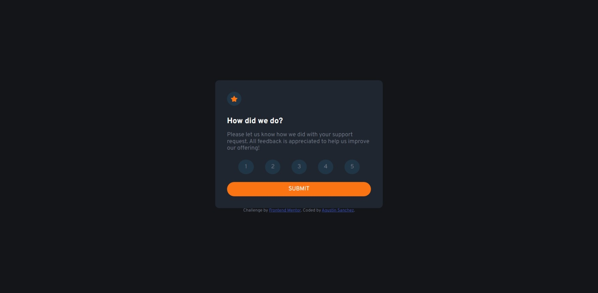

# Frontend Mentor - Interactive rating component solution

This is a solution to the [Interactive rating component challenge on Frontend Mentor](https://www.frontendmentor.io/challenges/interactive-rating-component-koxpeBUmI). Frontend Mentor challenges help you improve your coding skills by building realistic projects. 

## Table of contents

- [Frontend Mentor - Interactive rating component solution](#frontend-mentor---interactive-rating-component-solution)
  - [Table of contents](#table-of-contents)
  - [Overview](#overview)
    - [The challenge](#the-challenge)
    - [Screenshot](#screenshot)
    - [Links](#links)
  - [My process](#my-process)
    - [Built with](#built-with)
    - [What I learned](#what-i-learned)
    - [Continued development](#continued-development)
  - [Author](#author)

**Note: Delete this note and update the table of contents based on what sections you keep.**

## Overview

### The challenge

Users should be able to:

- View the optimal layout for the app depending on their device's screen size
- See hover states for all interactive elements on the page
- Select and submit a number rating
- See the "Thank you" card state after submitting a rating

### Screenshot

### Links

- Solution URL: [Repository](https://github.com/AgusSaMac/agussamac.github.io/tree/main/HMTL5%20CSS3%20JS/interactive-rating-component-main)
- Live Site URL: [Live site](https://agussamac.github.io/HMTL5%20CSS3%20JS/interactive-rating-component-main/index.html)

## My process

### Built with

- SASS
- Gulp
- Nodejs
- CSS flex
- Mobile-first

### What I learned

I created the workflow form scratch and that is what took the most of my time while developing. the actual time it took me to code the solution was probably a couple of hours.

### Continued development

Definitely need more practice with javascript.

## Author

- Frontend Mentor - [@AgusSaMac](https://www.frontendmentor.io/profile/AgusSaMac)
- Twitter - [@Agus490](https://twitter.com/agus490)
