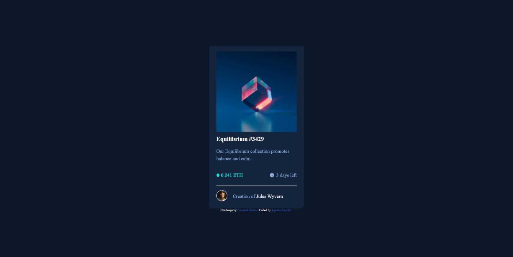

# Frontend Mentor - NFT preview card component solution

This is a solution to the [NFT preview card component challenge on Frontend Mentor](https://www.frontendmentor.io/challenges/nft-preview-card-component-SbdUL_w0U). Frontend Mentor challenges help you improve your coding skills by building realistic projects. 

## Table of contents

- [Frontend Mentor - NFT preview card component solution](#frontend-mentor---nft-preview-card-component-solution)
  - [Table of contents](#table-of-contents)
  - [Overview](#overview)
    - [The challenge](#the-challenge)
    - [Screenshot](#screenshot)
    - [Links](#links)
  - [My process](#my-process)
    - [Built with](#built-with)
    - [What I learned](#what-i-learned)
    - [Continued development](#continued-development)
    - [Useful resources](#useful-resources)
  - [Author](#author)

## Overview

### The challenge

Users should be able to:

- View the optimal layout depending on their device's screen size
- See hover states for interactive elements

### Screenshot



### Links

- Solution URL: [https://github.com/AgusSaMac/agussamac.github.io/tree/main/HTML5%20CSS3/nft-preview-card-component-main](https://github.com/AgusSaMac/agussamac.github.io/tree/main/HTML5%20CSS3/nft-preview-card-component-main)
- Live Site URL: [](https://your-live-site-url.com)

## My process

### Built with

- Semantic HTML5 markup
- CSS custom properties
- Flexbox
- CSS Grid
- Mobile-first workflow
- [React](https://reactjs.org/) - JS library
- [Next.js](https://nextjs.org/) - React framework
- [Styled Components](https://styled-components.com/) - For styles

**Note: These are just examples. Delete this note and replace the list above with your own choices**

### What I learned

Had the chance to use some positioning and z-omdex to give the solution the required interactivity, I use multiple nesting for this project (4 levels in the hover is included).

The following is the code I used to give the interactivity to the image, it has been done using SASS.

```
 .card__imagen {
        margin-top: 2rem;
        width: 29.3rem;
        height: 29.3rem;
        border-radius: 1rem;
        position: relative;
        .card__imagen__1 {
            position: absolute;
            width: 100%;
            z-index: 1;
        }
        .card__imagen__2 {
            position: absolute;
            z-index: 2;
            width: 100%;
            border-radius: 1rem;
            padding: 12.5rem;
            background-color: v.$cyanBk;
            opacity: 0%;
            &:hover {
                opacity: 100%;
            }
        }
    }
```

### Continued development

I may take another shot at this challenge later on as I feel I can optimize the nesting quite a bit. I used a container and a card classes to give the correct spacing however I feel that it would be possible to achieve the same result using only the card class.
Also I created a second cyan color for the background image in its active state. I may explore some more to see if I can forgo that extra variable.

### Useful resources

- [Convert colors](https://htmlcolors.com/hsl-to-rgb) - Useful to check the colors in other color system. for example hls to rgba.
- [Image overlapping](https://programmersportal.com/how-to-overlap-images-using-css/#:~:text=To%20overlap%20images%20in%20CSS,set%20its%20position%20to%20relative%20.) - This website gave me the solution on using z-index to give the images an order in which they would overlap.

## Author

- Frontend Mentor - [@AgusSaMac](https://www.frontendmentor.io/profile/AgusSaMac)
- Twitter - [@Agus490](https://www.twitter.com/agus490)