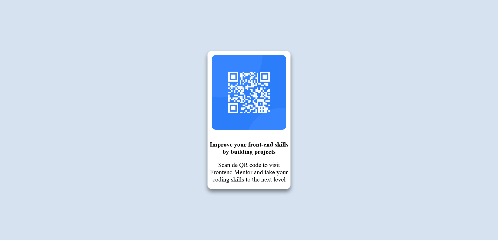

# Frontend Mentor - QR code component solution

This is a solution to the [QR code component challenge on Frontend Mentor](https://www.frontendmentor.io/challenges/qr-code-component-iux_sIO_H). 

## Table of contents

- [Frontend Mentor - QR code component solution](#frontend-mentor---qr-code-component-solution)
  - [Table of contents](#table-of-contents)
  - [Overview](#overview)
    - [Screenshot](#screenshot)
    - [Links](#links)
  - [My process](#my-process)
    - [Built with](#built-with)
    - [What I learned](#what-i-learned)
    - [Continued development](#continued-development)
    - [Useful resources](#useful-resources)
  - [Author](#author)

## Overview

### Screenshot

### Links

- Solution URL: [Github - AgusSaMac - QR code component](https://github.com/AgusSaMac/Frontend-Mentor-Challenges/tree/main/qr-code-component-main)

## My process

### Built with

- Semantic HTML5 markup
- CSS custom properties
- Flexbox
- [Normalize.css](https://styled-components.com/) - For explorer cross- compatibility.
- [Outfit](https://fonts.google.com/specimen/Outfit) - font family.

### What I learned

I learned how to set the maximum height of the webpage in accordance with the monitor height.

I reinforced my learning on the use of a flexbox and the BEM approach to code CSS.

### Continued development

I need to focus on learning more about the posible values diferent attributes can use. As I had to resort to a websearch to find how to set the monitor maximum height.

### Useful resources

- [Flexbox Guide](https://flaviocopes.com/flexbox/) - This site helped me to better understand how flexbox works and how its attributes work.
- [Choose CSS Units](https://getflywheel.com/layout/choose-css-unit-create-better-site-layouts-how-to/) - Article describing the types of units available. As a newbie this was a Godsend as I am still learning the basics. (05/07/22)

## Author

- Frontend Mentor - [@AgusSaMac](https://www.frontendmentor.io/profile/AgusSaMac)
